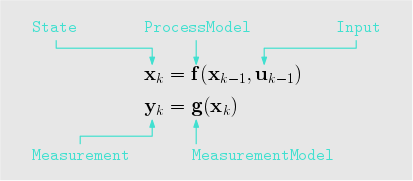

# pynav
An on-manifold state estimation library for robotics.

The core idea behind this project is to abstract-away the state definition such that a single estimator implementation can operate on a variety of state manifolds, such as the usual vector space, and any Lie group. 

Documentation can be found by opening this file in your browser: [./docs/build/html/index.html](./docs/build/html/index.html).
## Setup
### Dependencies
- python3.6+
- `pylie` Clone and install [this repo](https://github.com/decarsg/pylie) by following the README.
- All other dependencies should get installed automatically by `pip`

### Installation

Clone this repo, change to its directory, and execute 

    pip install -e .

### Examples
Some starting examples running EKFs can be found in the `examples/` folder. Simply run these as python3 scripts 

### Tests
To run integration tests, 

    pytest -ra tests/integration/

or, to run tests on a specific integration test file, 

    pytest -ra tests/integration/filename.py
    
## The Core Concept - Defining a `State` Implementation

The algorithms and models in this repo are centered around the abstract `State` class. An instance of `State` is an object containing, at a minimum, the following attributes:

- `value`: a value of some sort;
- `dof`: the degrees of freedom associated with the state.

It will also contain the following mandatory methods that must be implemented by the user.
- `plus()`:  A generic "addition" operation given a `dx` vector with as many
        elements as the `dof` of this state.
- `minus()`:  A generic "subtraction" operation given another State object of the same type, which returns a numpy array of error values.
- `copy()`: A method that returns a new object of the same type, and with the same attibute values.

Optionally, it is often useful to assign a timestamp (`stamp`) and a label (`state_id`) to differentiate state instances from others. The snippet below shows how to define a simple vector-space state:  


```python 
from pynav.types import State 
import numpy as np

class VectorState(State):
    """
    A standard vector-based state, with value represented by a 1D numpy array.
    """

    def __init__(self, value: np.ndarray, stamp: float = None, state_id=None):
        super(VectorState, self).__init__(
            value=value,
            dof=value.size,
            stamp=stamp,
            state_id=state_id,
        )

    def plus(self, dx: np.ndarray):
        self.value = self.value + dx

    def minus(self, x: "VectorState") -> np.ndarray:
        return self.value - x.value

    def copy(self) -> "VectorState":
        return VectorState(self.value.copy(), self.stamp, self.state_id)

```

As another more complicated example, a state object belonging to the SE(3) Lie group can be implemented as 

```python
from pynav.types import State 
from pylie import SE3 
import numpy as np 

class SE3State(State):
    def __init__(self, value: np.ndarray, stamp: float = None, state_id=None):
        super(SE3State, self).__init__(
            value=value,
            dof=6,
            stamp=stamp,
            state_id=state_id,
        )
    
    def plus(self, dx: np.ndarray):
        self.value = self.value @ SE3.Exp(dx)

    def minus(self, x: "SE3State") -> np.ndarray:
        return SE3.Log(SE3.inverse(x.value) @ self.value)

    def copy(self) -> "SE3State":
        return SE3State(self.value.copy(), self.stamp, self.state_id)

```

## Process and Measurement Models


There are a few more core types in this package. The main ones are the `ProcessModel` and `MeasurementModel` classes. Both of these are abstract classes requiring the user to implement

- an `evaluate()` method, 
- a `jacobian()` method,
- and a `covariance()` method.

For example, a simple "single integrator" (velocity input) model can be implemented as follows:

```python
class SingleIntegrator(ProcessModel):
    """
    The single-integrator process model is a process model of the form

        x_k = x_{k-1} + dt * u_{k-1}
    """

    def __init__(self, Q: np.ndarray):
        self._Q = Q

    def evaluate(self, x: VectorState, u: StampedValue, dt: float) -> np.ndarray:
        """
        Returns a state with an updated value according to a process model.
        """
        x.value = x.value + dt * u.value
        return x

    def jacobian(self, x: VectorState, u: StampedValue, dt: float) -> np.ndarray:
        """
        Jacobian of the process model with respect to the state.
        """
        return np.identity(x.dof)

    def covariance(self, x: VectorState, u: StampedValue, dt: float) -> np.ndarray:
        """
        Returns the covariance of the process model errors.
        """
        return dt**2 * self._Q
```

Similarly, a single distance-to-landmark measurement model can be implemented as 

```python 
class RangePointToAnchor(MeasurementModel):
    """
    Range measurement from a point state to an anchor (which is also another
    point).
    """

    def __init__(self, anchor_position: List[float], R: float):
        self._r_cw_a = np.array(anchor_position)
        self._R = np.array(R)

    def evaluate(self, x: VectorState) -> np.ndarray:
        r_zw_a = x.value
        y = np.linalg.norm(self._r_cw_a - r_zw_a)
        return y

    def jacobian(self, x: VectorState) -> np.ndarray:
        r_zw_a = x.value
        r_zc_a = r_zw_a - self._r_cw_a
        y = np.linalg.norm(r_zc_a)
        return r_zc_a.reshape((1, -1)) / y

    def covariance(self, x: VectorState) -> np.ndarray:
        return self._R
```

In fact, for both `ProcessModel` and `MeasurementModel`, subclasses will inherit a finite-difference numerical differentiation method `jacobian_fd()`, that allows for a seamless way to check your `jacobian()` implementation! (`evaluate()` method must be implemented for this to work, see some of the files in `tests/` for an example of this.)

## Built-in Library
Many state, process, and measurement models are already written and part of the built-in library and, as an example, can be accessed with 

```python
from pynav.lib.states import VectorState, SE3State
from pynav.lib.models import RangePoseToAnchor, Altitude
```
The following state types are currently part of the lib:
- `VectorState`
- `SO2State`
- `SO3State`
- `SE2State`
- `SE3State`
- `SE23State`
- `CompositeState` (for holding many sub-states as a single state)

The following process models are currently part of the lib:
- `SingleIntegrator`
- `BodyFrameVelocity`
- `RelativeBodyFrameVelocity`
- `CompositeProcessModel`

The following measurement models are currently part of the lib:
- `RangePointToAnchor`
- `RangePoseToAnchor`
- `RangePoseToPose`
- `RangeRelativePose`
- `GlobalPosition`
- `Altitude` 
- `Gravitometer`

Finally, this repo has the following state estimation algorithms implemented:
- `ExtendedKalmanFilter`
- `IteratedKalmanFilter`

## Contributing
If you wish to make some changes, create a branch, make your changes, and then make a pull request. Here are some conventions that should be followed:
- Code style should follow the PEP8 style guide. https://peps.python.org/pep-0008
- Everything should be type hinted as much as possible. Essentially, in the VS Code dark theme, you should not have any white text anywhere. 

The goal of this project is to write general algorithms that work for any implementation of the abstract `State`, `ProcessModel` and `MeasurementModel`. As such, please give thought to how this could be done to any algorithm you implement.


## Contributing to the Documentation
The documentation is automatically generated from python docstrings using `sphinx`, which can be installed by following [these instructions](https://www.sphinx-doc.org/en/master/usage/installation.html).

After sphinx is installed change to the `./docs/` directory and run 

    make html

and the documentation will be updated (you may need to install some dependencies... sorry. just follow the error prompts and install whats required. TODO).  In terms of actually writing documentation, we use the numpy format, which can be seen in some of the existing docstrings in the code, and can be used as a template. 

Alternatively and prefereably, install the [autoDocstring extension for VSCode](https://marketplace.visualstudio.com/items?itemName=njpwerner.autodocstring) and change the docstring format in the settings to `numpy`.


