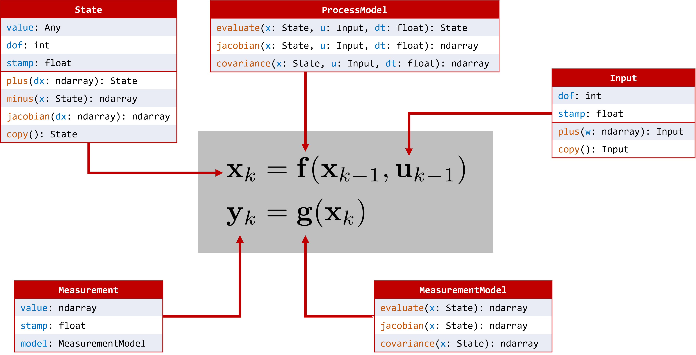

.. navlie documentation master file, created by
   sphinx-quickstart on Wed Aug 24 15:11:06 2022.
   You can adapt this file completely to your liking, but it should at least
   contain the root `toctree` directive.

.. toctree::
   :maxdepth: 1
   :hidden:

   Home <self>
   Tutorial <tutorial.rst>
   API <api>

Welcome to navlie!
------------------

navlie is a state estimation package specifically designed for both traditional and Lie-group-based estimation problems! 

The core idea behind this project is to use abstraction in such a way that both traditional and Lie-group-based problems fall under the exact same interface. Using this, a single estimator implementation can operate on a variety of state definitions, such as the usual vector space, and any Lie group. We allow the user to define their custom state, process model, and measurement models, after which they will have a variety of algorithms available to them, including:

- Extended Kalman Filter
- Iterated Extended Kalman Filter
- Sigmapoint Kalman Filters (Unscented, Spherical Cubature, Gauss-Hermite)
- Interacting Multiple Model Filter
- Batch MAP Estimation

In addition, navlie contains

- A large collection of common process and measurement models
- Out-of-the-box on-manifold numerical Jacobians using finite differencing
- Various utils for plotting, error, and consistency evaluation
- Monte Carlo experiment executor with result aggregation
- A preintegration module for linear, wheel odometry, and IMU process models

By implementing a few classes, the user can model a large variety of problems. The following diagram summarizes the abstraction

Installation
^^^^^^^^^^^^

Clone this repo, change to its directory, and execute 

.. code-block:: bash

   git clone git@github.com:decargroup/navlie.git 
   cd navlie && pip install -e .

This command should automatically install all dependencies, including our package `pymlg <https://github.com/decargroup/pymlg>`_ for back-end Lie group mathematical operations. 

Examples
^^^^^^^^
A more in-depth `tutorial <tutorial.rst>`_ can be found on this website, but there are also many examples found in the `examples/` folder. Simply run these as python3 scripts.